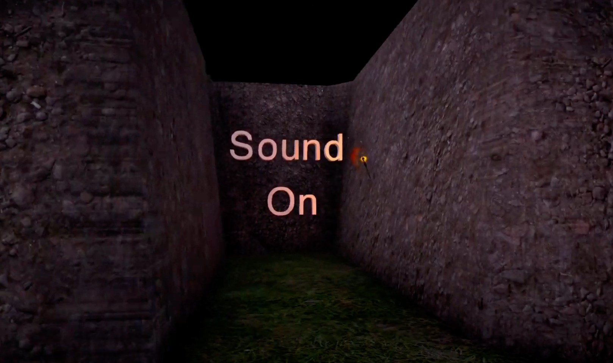
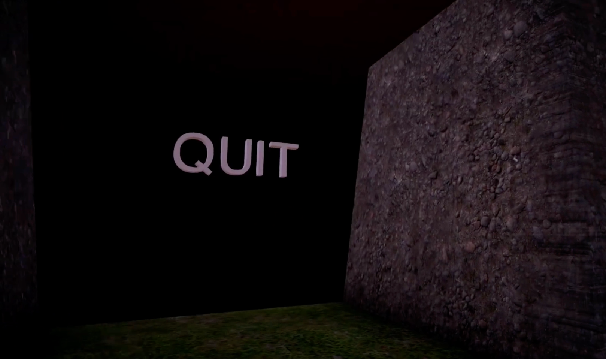
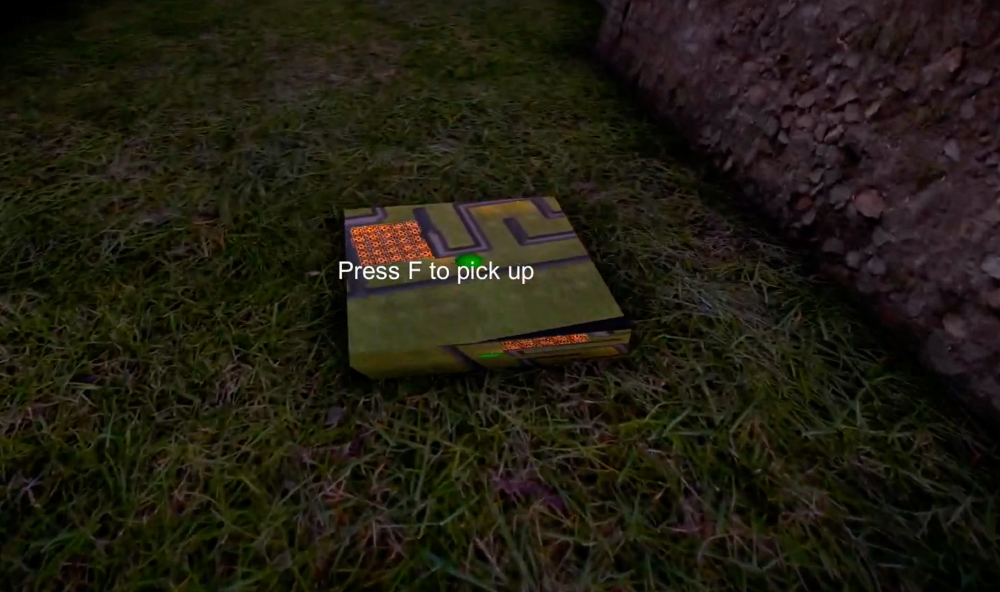
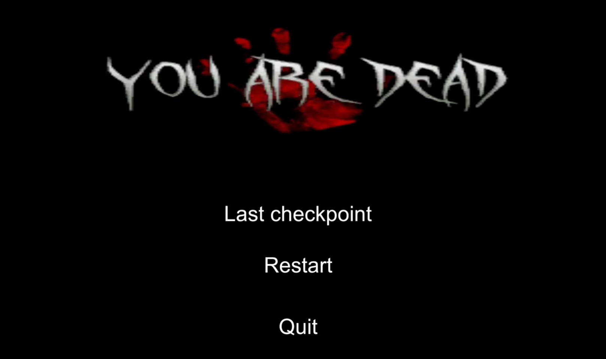

<!-- PROJECT LOGO -->
<br />
<p align="center">
  <a href="https://github.com/nicklamyeeman/Sparing-Abyss">
    
  </a>

  <h3 align="center">SPARING ABYSS</h3>

  <p align="center">
    Maze and horror game made for Keimyung University
    <br />
    <a href="https://github.com/nicklamyeeman/Sparing-Abyss"><strong>Explore the docs »</strong></a>
    <br />
    <br />
    <a href="https://github.com/nicklamyeeman/Sparing-Abyss/issues">Report Bug</a>
    ·
    <a href="https://github.com/nicklamyeeman/Sparing-Abyss/issues">Request Feature</a>
  </p>
</p>


<!-- TABLE OF CONTENTS -->
## Table of Contents

* [About the Project](#about-the-project)
  * [Built With](#built-with)
* [Getting Started](#getting-started)
  * [Prerequisites](#prerequisites)
  * [Installation](#installation)
* [Usage](#usage)
* [Roadmap](#roadmap)
* [Contributing](#contributing)
* [Contact](#contact)
* [Acknowledgements](#acknowledgements)


<!-- ABOUT THE PROJECT -->
## About The Project

This project is a Unity project made in the school of Keimyung University. It is a horror maze with traps and especially a monster that chases the player through the maze.


### Built With

* [Unity](https://unity.com/)


<!-- GETTING STARTED -->
## Getting Started

To get a local copy up and running follow these simple steps.

### Prerequisites

Be sure you have Unity installed on your PC, then open a terminal

### Installation

1. Clone the repo
```sh
git clone https://github.com/nicklamyeeman/Sparing-Abyss.git
```
2. Open Unity & download Unity version 2019.4.9f1

3. Open the game with Unity


<!-- USAGE -->
## Usage

Just launch the game. You just have to cross the road of the option you want to do : Play, Sound on/off or Quit game

<p float="left">
    
    
</p>
<br/>

Move around using and cross all the traps all along the maze :
             <kbd>Z</kbd>
<kbd>Q</kbd> <kbd>S</kbd> <kbd>D</kbd>


You can be helped with <kbd>Space</kbd> that make you jump.



You can pick up objects with <kbd>F</kbd>. Only maps and torches are pickable.
Throw any item of your left or right hand with respectively <kbd>A</kbd> and <kbd>E</kbd> 

Be fast enough or you'll be facing the monster inside the maze and the issue isn't good



### BE CAREFUL

This version is NOT be the last one for copyright reasons.

There is a gameplay video there : 
[](https://www.youtube.com/watch?v=HheH5rQ7_Ak "Sparing Abyss")


<!-- ROADMAP -->
## Roadmap

See the [open issues](https://github.com/nicklamyeeman/Sparing-Abyss/issues) for a list of proposed features (and known issues).


<!-- CONTRIBUTING -->
## Contributing

Contributions are what make the open source community such an amazing place to be learn, inspire, and create. Any contributions you make are **greatly appreciated**.

1. Fork the Project
2. Create your Feature Branch (`git checkout -b feature/AmazingFeature`)
3. Commit your Changes (`git commit -m 'Add some AmazingFeature'`)
4. Push to the Branch (`git push origin feature/AmazingFeature`)
5. Open a Pull Request

We were 2 originally on this project : 
 - [LAM YEE MAN Nick](https://github.com/nicklamyeeman)
 - [DEMEESTER Alexandre](https://github.com/rokuo)
 - [MALARDE Arthur](https://github.com/arthurqqq)
 - [DESPAGNE Eddy](https://github.com/Minijinski)


<!-- CONTACT -->
## Contact

Nick LAM YEE MAN - [@nickauteen](https://twitter.com/nickauteen) - nick.lam-yee-man@epitech.eu

Project Link: [https://github.com/nicklamyeeman/Sparing-Abyss](https://github.com/nicklamyeeman/Sparing-Abyss)


<!-- ACKNOWLEDGEMENTS -->
## Acknowledgements

* [Best-README Template](https://github.com/othneildrew/Best-README-Template)


<!-- MARKDOWN LINKS & IMAGES -->
<!-- https://www.markdownguide.org/basic-syntax/#reference-style-links -->
[contributors-shield]: https://img.shields.io/github/contributors/nicklamyeeman/repo.svg?style=flat-square
[contributors-url]: https://github.com/nicklamyeeman/repo/graphs/contributors
[forks-shield]: https://img.shields.io/github/forks/nicklamyeeman/repo.svg?style=flat-square
[forks-url]: https://github.com/nicklamyeeman/repo/network/members
[stars-shield]: https://img.shields.io/github/stars/nicklamyeeman/repo.svg?style=flat-square
[stars-url]: https://github.com/nicklamyeeman/repo/stargazers
[issues-shield]: https://img.shields.io/github/issues/nicklamyeeman/repo.svg?style=flat-square
[issues-url]: https://github.com/nicklamyeeman/repo/issues
[license-shield]: https://img.shields.io/github/license/nicklamyeeman/repo.svg?style=flat-square
[license-url]: https://github.com/nicklamyeeman/repo/blob/master/LICENSE.txt
[linkedin-shield]: https://img.shields.io/badge/-LinkedIn-black.svg?style=flat-square&logo=linkedin&colorB=555
[linkedin-url]: https://linkedin.com/in/nicklamyeeman
[product-screenshot]: images/screenshot.png